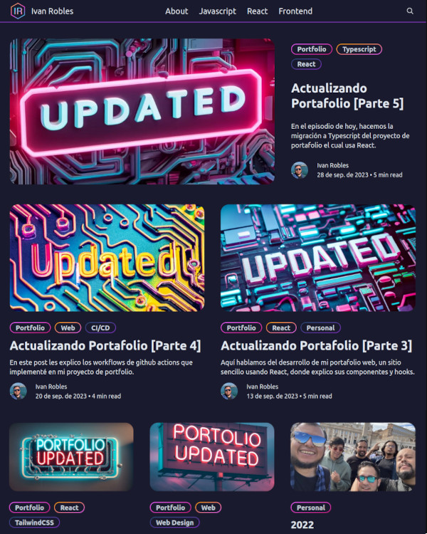

# The Sharmaz Theme

A custom Ghost theme for [ivanrobles.pro](https://ivanrobles.pro/)



## Ghost Themes

Ghost uses a simple templating language called [Handlebars](http://handlebarsjs.com/) for its themes.
The Sharmaz is based on the ghost [starter theme](https://github.com/TryGhost/Starter) wich use [`Rollup`](rollup.config.js), so I added [TailwindCSS](https://tailwindcss.com/) for the styles.

## Theme structure

The main files are:

- [`default.hbs`](default.hbs) - The main template file
- [`index.hbs`](index.hbs) - Used for the home page
- [`post.hbs`](post.hbs) - Used for individual posts
- [`page.hbs`](page.hbs) - Used for individual pages
- [`tag.hbs`](tag.hbs) - Used for tag archives
- [`author.hbs`](author.hbs) - Used for author archives

## Development

To see realtime changes during development, symlink the sharmaz theme folder to the `content/themes` folder in your local Ghost install. 

```bash
ln -s /path/to/the-sharmaz /ghost/content/themes/the-sharmaz
```

Restart Ghost and select the sharmaz theme from **Settings**.

From the theme's root directory, install the dependencies:

```bash
yarn install
```

### Start development mode

From the sharmaz theme folder, start development mode:

```bash
yarn dev
```

Changes you make to your styles, scripts, and Handlebars files will show up automatically in the browser. CSS and Javascript will be compiled and output to the `built` folder.

Press `ctrl + c` in the terminal to exit development mode.

### Build, test, and zip the theme

Compile your CSS and JavaScript assets for production with the following command:

```bash
yarn build
```


Use `gscan` to test your theme for compatibility with Ghost:

```bash
yarn test
```

Create a zip archive:

```bash
yarn zip
```

## Copyright & License

Copyright (c) The Sharmaz - Released under the [MIT license](LICENSE).
